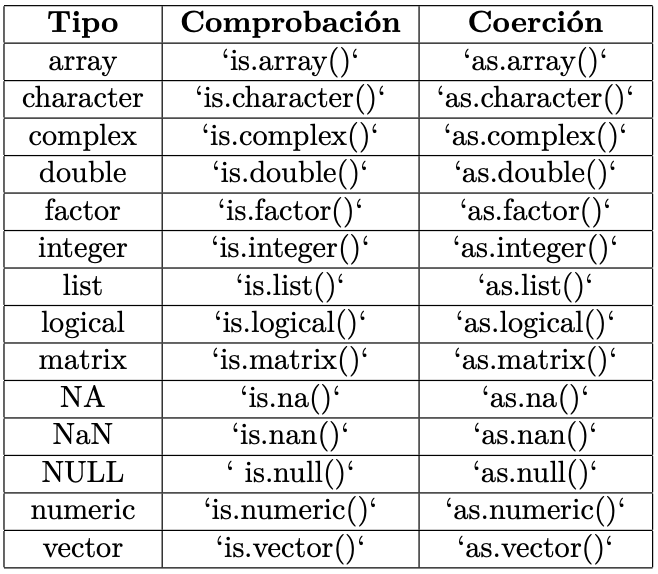

```{r setup general, include=FALSE}
knitr::opts_chunk$set(echo = TRUE, eval = FALSE)
```

# Introducció a les eines de R

## Origen de R

-   **Primer llançament:** Ross Ihaka & Robert Gentleman (University of Auckland 1996)

-   Implementa un dialecte del llenguatge S (John Chambers, Rick Becker, Alan Wilks, AT&T Bell Laboratories 1976) (versió comercial S-PLUS)

-   Actualment, l'equip interinstitudicional *"R Core Development Team"*

-   The CRAN project (Comprehensive R Archive Network)

## Introducció a R

R és un paquet estadístic gratuït molt flexible

-   Admet el análisis estadístic

-   Admet la gestió de dades de diferents fonts

-   Admet la visualització de la informació

-   Generació de paquets:

    -   Admet la definició de noves funcions

    -   Admet la definició de nous prodeciments (llenguatge de programació S)

## Com utilitzar el R

-   Obrir el software:

    -   Icone de l'escriptori

    -   Seleccionar des de **tots els programes**

    -   Amb interfaç addicionals (Rstudio, ...)

-   Interactuar amb R:

    -   Intèrpret d'ordres. Indicador: `>`

    -   Escriure codi en la consola (si hi han diferents ordres, colapsar les ordres separats amb `;`) i apretar el enter

    -   Es pot executar códi executant `CNTRL + ENTER`

    -   Visualitzar la resposta al moment

-   Per sortir:

    -   Codi: `q()`

    -   Menú: **Exit**

## Com anar a les ajudes

-   `?help`

-   `help(name_command)` or `?name_command`

-   `help.search("keyword")`: Totes les ordres amb paraula clau

-   `help.stard()`: Obre documentació *on-line* en R

-   `? 'operator'`: per a operacions o paraules reservades del llenguatge S

    -   `?'if'`: Retorna l'ajut sobre sentencies condicionals.

    -   `?'&&'`: Retorna l'ajut sobre conjuncions lógiques.

-   Existeix la opció `Help` en el menú

## Obrir i recuperar una sessió

-   Es treballa en memoria (del PC)

-   `q()` Cancela tot el que no s'hagi guardat préviament (envia i avisa)

-   Formes de guardar:

    -   `save.image()`

    -   Crea un fitxer `.RData`

    -   Es pot recuperar en la següent sessió

-   Consulteu l'ajuda sobre com guardar i fer recuperacions parcials

-   `utils::sessionInfo()` Consultar les característiques de la sessió

## Tipus de variables

{fig-align="center"}

-   Creació per defecte amb l'assignació: `<-` o `->`

-   Valors especials:

    -   `NA`: per a dades mancants

    -   `Inf`: Infinit (divisió per 0, ...)

    -   `NaN`: Error obtingut com a resultat d'aplicar una funció

------------------------------------------------------------------------

```{r}
ls(pattern = "^is", baseenv())
```

{fig-align="center"}

## Variables de tipus data

{fig-align="center"}

```{r}
library(tidyverse)
library(lubridate)
```

-   És un paquet creat amb la finalitat de manipular dates i dades de temps en R.

-   En tots els casos, s'ha de modificar la clase de les dades.

-   S'ha d'identificar el format en el que están les dades.

```{r}
# Crea el format data
data <- as.Date(dades$data, format = "%y%m%d")

# Transforma les dades
library(lubridate)
dataLubri <- ymd(dades$data)
```

------------------------------------------------------------------------

### Operacions amb dates

-   Extreure l'any

```{r}
year(dataLubri)
```

-   Extreure el mes

```{r}
month(dataLubri)
```

-   Extreure el dia

```{r}
day(dataLubri)
```

-   Diferencia de dates

```{r}
difftime(data1, data2, units = "weeks")
```

## Obtenir informació

-   `ls()` o `objects()`: Mostra tots els objectes de l'entorn de treball

-   `str(object)` o `attributes()`: Retorna informació de l'objecte

-   Eliminar objectes de l'entorn:

    -   `rm(object)`

    -   `rm(part1, part2, object)`

## Com utilitzar RStudio

{fig-align="center"}

# Organització d'un projecte de R

## Instalació de paquets

```{r}
#| label: setup
#| message: true
#| echo: true
# Paquetes base y útiles:
packs <- c("here", "glue", "fs", "readr", "dplyr", "ggplot2")
to_install <- setdiff(packs, rownames(installed.packages()))
if (length(to_install)) install.packages(to_install, quiet = TRUE)

library(here)    # Rutas relativas desde la raíz del proyecto
library(glue)    # Strings con llaves {var}
library(fs)      # Operaciones de sistema "friendly"
library(readr)   # Lectura/escritura rápida
library(dplyr)   # Manipulación de datos
library(ggplot2) # Gráficos

# Opciones útiles
options(
  scipen = 999,   # menos notación científica
  digits = 4
)

# Mostrar dónde cree {here} que está la raíz del proyecto
here()
```

## Estructura recomanada de carpetes

La estructura proposada es la següent:

``` graphql
project/
├─ syntax/        # scripts R (funcions, notebooks, etc.)
├─ input/         # insumos externos (CSV, XLSX, etc.) només LECTURA
├─ data/          # dades intermitjes: netes/parquet/rds
├─ output/        # resultats finals (tables/figures/llistats)
├─ temp/          # temporals per eliminar
├─ logs/          # logs de ejecució
├─ README.md
└─ .here          # marca de l'arrel del projecte p/ {here}
```

Per crear l'estructura podem fer el següent:

```{r, eval = FALSE, echo = TRUE}
# Crea l'estructura de carpetes si no existeixen
dirs <- c("syntax", "input", "data", "output", "temp", "logs")
dir_create(path = here(dirs))
dir_ls(here(), type = "directory")
```

## Usos de rutes relatives

Utilitza `here("carpeta", "sub", "archivo.ext")` per a **rutas portables**:

```{r, echo = TRUE}
# Construir rutas de forma segura:
ruta_input  <- here("input", "ventas_2025.csv")
ruta_data   <- here("data",  "ventas_limpio.rds")
ruta_salida <- here("output","resumen_ventas.csv")

ruta_input
ruta_data
ruta_salida

# Con base R: file.path() también es portable
file.path("input", "ventas_2025.csv")
```

------------------------------------------------------------------------

### Bones pràctiques amb `{here}`

-   Insertar un fitxer `.here` o un `.Rproj` en l'arrel.
-   **Mai** utilitzis `setwd()` dintre d'un script reutilitzables.
-   Escriure funcions que rebin rutes **com arguments** o que construeixin rutes amb `here()`.

```{r}
# Función ejemplo usando here()
lee_input <- function(nombre) {
  readr::read_csv(here("input", nombre), show_col_types = FALSE)
}

# Uso:
# df <- lee_input("ventas_2025.csv")
```

## Missatges i nombre de fitxers dinàmics

```{r}
anio <- 2025; mes <- 9
nombre_csv <- glue("ventas_{anio}-{sprintf('%02d', mes)}.csv")
here("input", nombre_csv)
```

`glue()` evalua expressions dintre de `{}`:

```{r}
clientes <- 1250
glue("Este mes se han registrado {clientes} clientes (Δ = {clientes - 1200}).")
```

## Crear i búsqueda de fitxers

### Guardar fitxers

```{r}
# Datos de ejemplo:
df <- tibble::tibble(
  id = 1:5,
  fecha = as.Date("2025-09-01") + 0:4,
  ventas = c(100, 80, 95, 120, 110)
)

# Guardar como CSV en output/
write_csv(df, here("output", "tabla_ejemplo.csv"))

# Guardar como RDS en data/
saveRDS(df, here("data", "tabla_ejemplo.rds"))
```

------------------------------------------------------------------------

### Búsqueda de fitxers

`list.files()` (base) y `fs:dir_ls()` (recursiu, amb *globbing*):

```{r}
# Listado simple
list.files(here("output"))

# Listado recursivo con patrón:
dir_ls(here(), recurse = TRUE, glob = "output/*.csv")

# Buscar por ext. en múltiples carpetas:
dir_ls(here(c("input","data","output")), recurse = TRUE, 
       regexp = "\\.(csv|rds)$")
```

## Redirigir sortides amb `sink()`

```{r}
log_path <- here("logs", glue("log_{format(Sys.time(), '%Y%m%d_%H%M%S')}.txt"))

sink(log_path, split = TRUE)      # split=TRUE => también muestra en consola
cat("=== INICIO ===\n")
print(sessionInfo())
cat("Una línea cualquiera\n")
sink()  # IMPORTANTÍSIMO: cerrar el sink

# Revisa el contenido del log:
readLines(log_path, n = 8)
```

⚠️ Tanca SEMPRE el `sink()` amb `sink()` (sense arguments) o utilitza `on.exit(sink())` dintre d'una funció per no “bloquejar” la consola.

## Guardar gràfics

```{r}
pdf(here("output", "grafico_demo.pdf"), width = 7, height = 5)
plot(cars, main = "Gráfico base R - cars")
dev.off()

# PNG con resolución
png(here("output", "grafico_demo.png"), width = 1200, height = 900, res = 150)
plot(pressure, main = "Gráfico base R - pressure")
dev.off()
```

------------------------------------------------------------------------

### Amb `ggplot2`

```{r}
p <- ggplot(mtcars, aes(disp, mpg)) + geom_point() +
  labs(title = "Relación cilindrada vs. mpg")

# Guardar directamente
ggsave(filename = here("output", "mtcars_disp_mpg.png"), plot = p,
       width = 7, height = 5, dpi = 150)

# También PDF
ggsave(filename = here("output", "mtcars_disp_mpg.pdf"), plot = p,
       width = 7, height = 5)
```

## Mini *pipeline* de exemple

A continuació tens un exemple de un *pipeline* que: **leer → procesar → guardar**

```{r}
# 1) Crear un CSV de ejemplo en input/
dir_create(here("input"))
toy <- tibble::tibble(
  id = 1:10,
  fecha = as.Date("2025-09-01") + 0:9,
  ventas = sample(80:150, 10, replace = TRUE)
)
write_csv(toy, here("input", "toy_ventas.csv"))

# 2) Leer, procesar y registrar
log_path <- here("logs", "mini_pipeline.log")
sink(log_path, split = TRUE)
cat("== MINI PIPELINE ==\n")

raw <- read_csv(here("input", "toy_ventas.csv"), show_col_types = FALSE)
cat(glue("Leídas {nrow(raw)} filas.\n"))

proc <- raw |>
  mutate(
    semana = format(fecha, "%Y-%W"),
    ventas_norm = scale(ventas)[,1]
  ) |>
  group_by(semana) |>
  summarise(ventas_media = mean(ventas), .groups = "drop")

cat(glue("Semanas agregadas: {nrow(proc)}\n"))
```

## Mini *pipeline* de exemple

A continuació tens un exemple de un *pipeline* que: **leer → procesar → guardar**

```{r}
# 3) Guardar resultados
write_csv(proc, here("output", "resumen_semanal.csv"))
saveRDS(proc, here("data", "resumen_semanal.rds"))
cat("Archivos guardados en output/ y data/\n")
sink()

# 4) Graficar y guardar
p <- ggplot(raw, aes(fecha, ventas)) + geom_line() +
  labs(title = "Ventas diarias (toy)", x = "Fecha", y = "Ventas")
ggsave(here("output", "ventas_toy.png"), plot = p, width = 7, 
       height = 5, dpi = 150)
```

## Utilitats (helpers) per als teus scripts de `syntax/`

```{r}
# Guardar en syntax/helpers.R y luego source("syntax/helpers.R") si quieres

init_log <- function(prefix = "run") {
  dir_create(here("logs"))
  path <- here("logs", 
               glue("{prefix}_{format(Sys.time(), '%Y%m%d_%H%M%S')}.log"))
  sink(path, split = TRUE)
  cat(glue("[{Sys.time()}] INICIO\n"))
  return(path)
}

close_log <- function() {
  cat(glue("[{Sys.time()}] FIN\n"))
  sink()
}

safe_dir <- function(...) {
  # Crea una ruta y la carpeta si no existe
  path <- here(...)
  dir_create(dirname(path))
  return(path)
}

save_table <- function(df, ..., name, ext = "csv") {
  # Guarda tabla df en output/ con nombre dinámico
  base <- glue("{name}.{ext}")
  path <- safe_dir("output", base)
  if (ext == "csv") readr::write_csv(df, path)
  if (ext == "rds") saveRDS(df, sub("\\.csv$", ".rds", path))
  invisible(path)
}
```

## Pautes de versionat i neteja

-   Tot el que **NO** sigui una font, s'ha de ficar sota control (ej: borrar `/temp/` al finalitzar)
-   Utilitzar `git` per a versionar scripts i notebooks.
-   Separar la **lectura** (`input/`) de **resultats** (`output/`) i **dades de treball** (`data/`).

```{r}
# Limpieza de temporales
if (dir_exists(here("temp"))) {
  file_delete(dir_ls(here("temp"), recurse = TRUE, type = "file"))
}
```

------------------------------------------------------------------------

### Alternatives útils

-   `fs::file_copy()`, `fs::file_move()`, `fs::file_delete()` per a copiar/moure/esborrar.
-   `Sys.getenv("VAR")` per a llegir variables d'entorn.
-   `withr::with_dir()` per executar codi en otra ubicació sense canviar el `wd` global.

```{r}
# Copiar un archivo de ejemplo
fs::file_copy(here("output", "tabla_ejemplo.csv"),
              here("temp", "copia_tabla.csv"),
              overwrite = TRUE)

# Variables de entorno
Sys.getenv("HOME")
```

## 

::: {style="display:flex; justify-content:space-between; align-items:center;"}
<h2 style="margin:0;">

Enviar correus automàtics

</h2>


:::

El paquet `blastula` facilita la creació i l'enviament de correus electrònics HTML desde R.

El missatge pot tenir 3 areas de contingut (cos, capçalera i peu de pàgina) i permet insertar text *Markdown*, components basats en blocs i inclús fragments d'HTML.

El HTML/CSS subjacent està dissenyat per a visualitzar-se correctament en una amplia gamma de clients de correu electrónic i serveis de correu web.

El missatge resultant és *responde*, pel que que es veurà genial tant en pantalles grans com en dispositius mòbils.

## 

::: {style="display:flex; justify-content:space-between; align-items:center;"}
<h2 style="margin:0;">

Enviar correus automàtics

</h2>


:::

```{r}
# Get a nicely formatted date/time string
date_time <- add_readable_time()

# Create an image string using an on-disk
# image file
img_file_path <-
  system.file(
    "img", "pexels-photo-267151.jpeg",
    package = "blastula"
  )

img_string <- add_image(file = img_file_path)

email <-
  compose_email(
    body = md(glue::glue(
        "Hello,
        
        This is a *great* picture I found when looking
        for sun + cloud photos:
        
        {img_string}
        ")),
    footer = md(glue::glue("Email sent on {date_time}."))
  )
```
