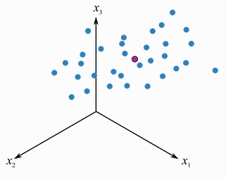

## Introducción

El análisis de componentes principales (principal component analysis) o PCA es una de las técnicas de aprendizaje no supervisado, las cuales suelen aplicarse como parte del análisis exploratorio de los datos. A diferencia de los métodos de aprendizaje supervisado, donde contamos con un grupo de variables o características ($X = X_{1}, X_{2}, ..., X_{p}$) medidas sobre un conjunto de observaciones $n$, con la intención de obtener predicciones sobre una variable respuesta 𝑦 asociada, en los no supervisados solo contamos con un número de variables de las cuales nos interesa conocer o de las que queremos extraer información, por ejemplo, sobre la existencia de subgrupos entre las variables u observaciones.

Una de las aplicaciones de PCA es la reducción de dimensionalidad (variables), perdiendo la menor cantidad de información (varianza) posible: cuando contamos con un gran número de variables cuantitativas posiblemente correlacionadas (indicativo de existencia de información redundante), PCA permite reducirlas a un número menor de variables transformadas (componentes principales) que expliquen gran parte de la variabilidad en los datos. Cada dimensión o componente principal generada por PCA será una combinación lineal de las variables originales, y serán además independientes o no correlacionadas entre sí. Las componentes principales generadas pueden utilizarse a su vez en métodos de aprendizaje supervisado.

El PCA también sirve como herramienta para la visualización de datos: supóngase que quisiéramos representar $n$ observaciones con medidas sobre $p$ variables ($X = X_{1}, X_{2}, ..., X_{p}$) como parte de un análisis exploratorio de los datos. Lo que podríamos hacer es examinar representaciones bidimensionales, sin embargo, existen un total de $\binom{p}{2} = p(p-1)/2$ posibles representaciones entre pares de variables, y si el número de variables es muy alto, estas representaciones se harían inviables, además de que posiblemente la información contenida en cada una sería solo una pequeña fracción de la información total contenida en los datos.

El PCA puede considerarse como una rotación de los ejes del sistema de coordenadas de las variables originales a nuevos ejes ortogonales, de manera que estos ejes coincidan con la dirección de máxima varianza de los datos.

*NOTA: El PCA no requiere la suposición de normalidad multivariante de los datos.*

### Variables latents

Para entender una variable latente de forma conceptual, pongamos un ejemplo: la salud general de un individuo. Este estado podría considerarse como una variable latente, sin embargo, no existe una única medida que determine este estado (el cual es un concepto abstracto), sino que es una combinación de medidas físicas (temperatura, presión arterial, azúcar en sangre, nivel de colesterol, etc.). Es este conjunto el que determina el resultado del nivel de salud.

Otro ejemplo sería la medición de temperatura en una sala haciendo uso de un conjunto de termómetros, cada uno situado en un punto concreto. Imaginemos que queremos monitorizar la temperatura tomamos medidas de tres termómetros distintos ($x_{1}, x_{2}, x_{3}$) cada cuarto de hora:

```{r}
library('MASS')
library(dplyr)

# Datos artificiales:

N <- 100 # numero de medidas
r <- 0.83 # correlacion entre medidas de los termometros

# Medidas de temperatura de cada termometro, con media 23ºC
set.seed(589)
temperaturas <- mvrnorm(n = N, 
                        mu = c(23, 23, 23), 
                        Sigma = matrix(c(1, r, r, r, 1, r, r, r, 1), nrow = 3), 
                        empirical = TRUE) %>% as.data.frame() %>% round(2)
colnames(temperaturas) <- c("x1", "x2", "x3")
rownames(temperaturas) <- seq(from = 0, to = 1485, by = 15) # tiempos de medida

head(temperaturas)
```
```{r}
library(ggplot2)
ggplot(temperaturas, aes(x = x1, y = x2)) + 
  geom_point()

library(scatterplot3d)
scatterplot3d(temperaturas$x1, temperaturas$x2, temperaturas$x3, color = "black", )
```
Las fluctuaciones en las medidas de cada termómetro representan la variación de la temperatura de la sala, la cual representa la variable latente. Por tanto, cada medida del termómetro se encuentra correlacionada con la variable latente. Pueden aparecer también medidas inusuales (por fallos del sensor, etc.) que destaquen sobre el patrón general y que pueden ser detectados.

Si quisiéramos contar con una medida única de temperatura, lo que podríamos hacer es aplicar la media de temperatura de los tres termómetros en cada tiempo ($t_t$). Matemáticamente, este cálculo correspondería con:

$$
t_t = [x_{1} \quad x_{2} \quad x_{3}] \begin{bmatrix}
p_{1,t} \\
p_{2,t} \\
p_{3,t}
\end{bmatrix} = x_{1} p_{1,t} + x_{2} p_{2,t} + x_{3}p_{3,t}
$$
siendo los pesos $p_{1,t}, p_{2,t}, p_{3,t} = 1/3$

Es decir, $t_t$, es una combinación lineal de las medidas originales $x_{1}, x_{2}, x_{3}$ en función de los pesos $p_{1,t}, p_{2,t}, p_{3,t}$.

Por tanto, las variables latentes capturan un fenómeno subyacente del sistema que estamos investigando, y podemos utilizar estas variables en lugar de las originales debido a su correlación. En la práctica no se calcula una sola variable latente, sino un conjunto, a partir de todas las variables disponibles del conjunto de datos.

### Explicación geométrica del PCA

Siguiendo con el ejemplo anterior, imaginemos que la distribución de los datos sobre las 3 dimensiones (𝑝=3) es la siguiente:

{fig.caption="center"}

### Álgebra matricial

#### Eigenvectores y eigenvalores

## Estandarización de las variables

## Cálculo de las componentes principales

## Proporción de la varianza explicada

### Número óptimo de componentes principales


