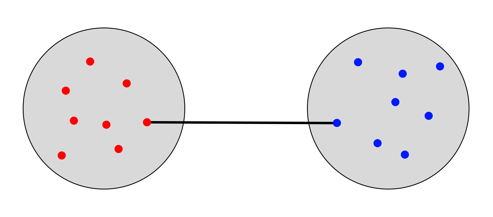
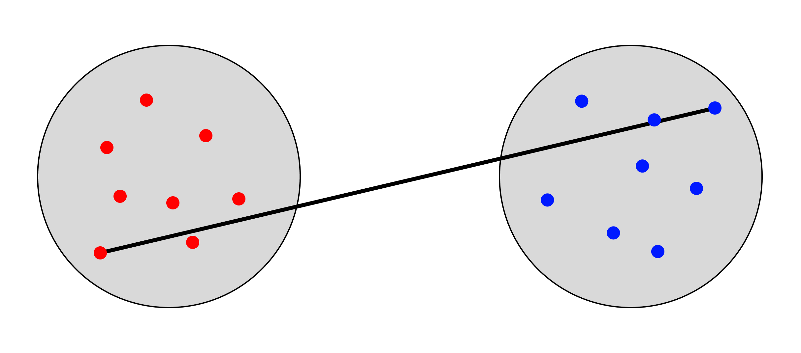
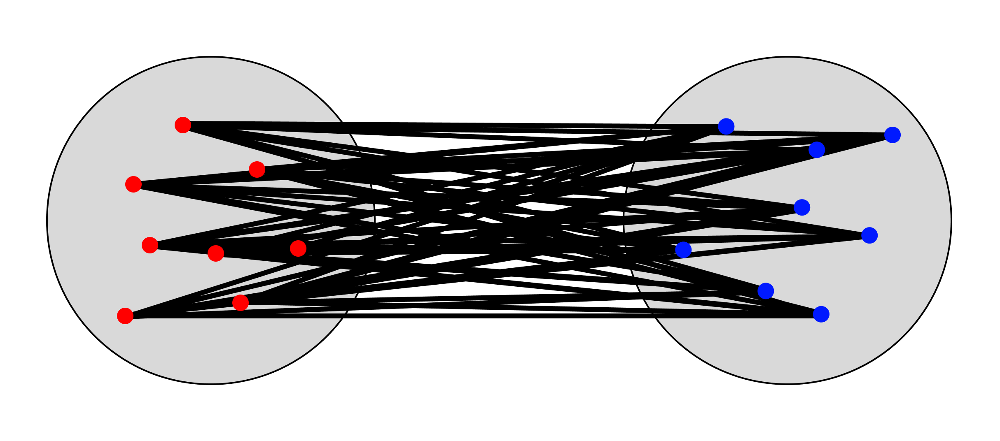
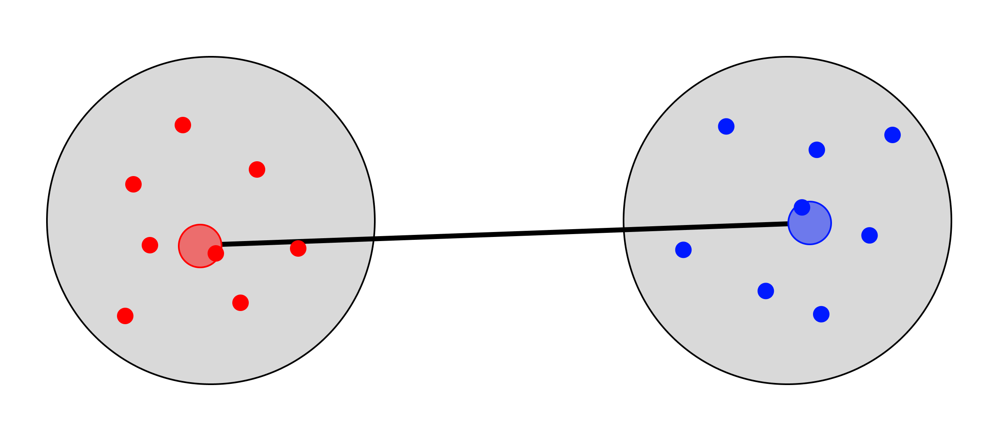
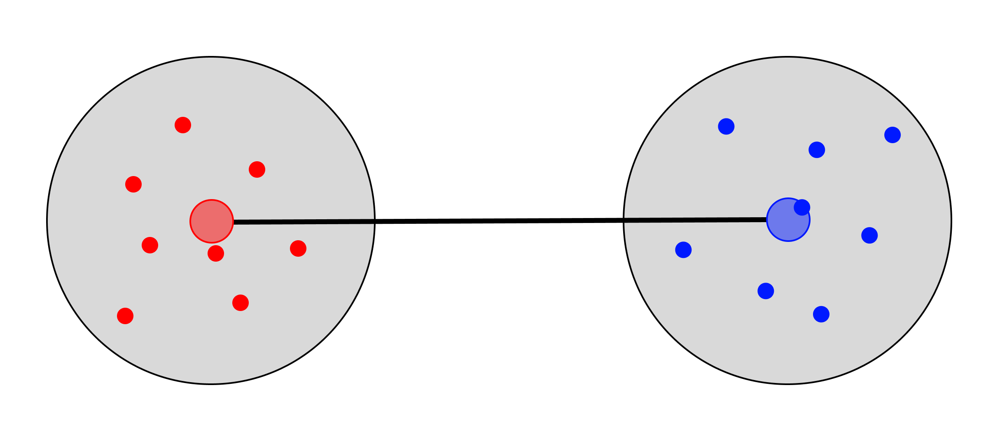
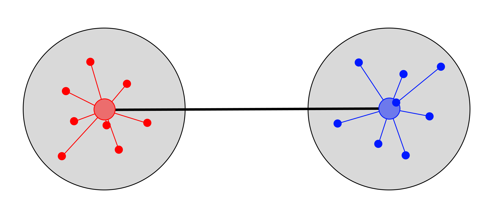

En este documento se presentan los principales enfoques de clustering aplicados sobre una base de datos de comportamiento de compra. 

La idea no es únicamente ejecutar funciones, sino entender qué hace cada técnica, cuándo conviene usarla y cómo interpretar los resultados. A lo largo del material se combinan ejemplos ejecutables con fragmentos ilustrativos que sirven como plantilla para otros conjuntos de datos.

```{r}
#| warning: false
#| error: false
#| message: false
# Cargamos las librerías necesarias.
# Se incluyen paquetes para:
# - manipulación y visualización
# - clustering particional y jerárquico
# - métricas de validación
# - representación gráfica de dendrogramas
list.of.packages <- c(
  "dplyr", "fpc", "reshape2", "tidyr", "ggplot2", "stats", 
  "cluster", "factoextra", "colorspace", "patchwork", 
  "tidyverse", "ggpubr", "NbClust", "HDclassif", "clustMixType", 
  "clusterSim", "pracma", "DataVisualizations", "entropy",
  "clevr", "dendextend", "ggdendro", "gridExtra"
)

new.packages <- list.of.packages[!(list.of.packages %in% installed.packages()[, "Package"])]
if (length(new.packages) > 0) {
  install.packages(new.packages)
}

invisible(lapply(list.of.packages, require, character.only = TRUE))
rm(list.of.packages, new.packages)
```

```{r}
# Cargamos la base de datos directamente desde GitHub
url <- "https://raw.githubusercontent.com/ramIA-lab/MLforEducation/refs/heads/main/material/clustering/shopping_behavior_updated.csv"
dades <- read.csv(url)
rm(url)
```

```{r}
# Identificamos el tipo de las variables para separar correctamente
# las cuantitativas de las categóricas.
tipo <- sapply(dades, class)

varNum <- names(tipo)[which(tipo %in% c("integer", "numeric"))]
varNum <- varNum[which(!varNum %in% c("Customer.ID"))]

varCat <- names(tipo)[which(tipo %in% c("character", "factor"))]

# Creamos una copia de trabajo
data <- dades
```

Antes de aplicar cualquier algoritmo, es importante distinguir la naturaleza de las variables. Algunos métodos requieren exclusivamente datos numéricos, mientras que otros permiten trabajar con información mixta. Esta separación será clave más adelante al elegir la distancia y el algoritmo de agrupación.

::: callout-note
## Idea clave

En clustering no existe un método universalmente mejor. La elección depende del tipo de variables, de la distancia utilizada y del objetivo analítico: segmentar, explorar estructura o describir perfiles.
:::

# Métodos Particionales

Los métodos particionales generan una partición directa del conjunto de datos en un número prefijado de grupos. A diferencia de los métodos jerárquicos, aquí se fija el valor de (k) y el algoritmo reasigna observaciones hasta optimizar un criterio interno como la inercia o la disimilitud total.

```{r}
#| message: false
# Escalamos las variables numéricas para que todas contribuyan de forma comparable.
# Este paso es especialmente importante en métodos basados en distancias.
data <- scale(data[, varNum], center = TRUE, scale = TRUE)
str(data)
```

## Calculamos las distintas distancias

Antes de agrupar, conviene estudiar cómo se mide la proximidad entre individuos. La distancia elegida condiciona directamente la forma de los clusters que se obtendrán.

### Distancia euclídea

Es la distancia geométrica habitual entre dos puntos en un espacio multidimensional. Es una opción natural cuando trabajamos con variables numéricas previamente escaladas.

```{r}
mat_dist <- dist(x = data, method = "euclidean")
round(as.matrix(mat_dist)[1:5, 1:5], 2)
```

### Distancia basada en la correlación de pearson

Esta medida resulta útil cuando interesa comparar perfiles o patrones de comportamiento más que magnitudes absolutas. Dos individuos pueden quedar próximos si evolucionan de forma similar en las variables, aunque sus valores concretos no coincidan.

```{r}
mat_dist <- get_dist(x = data, method = "pearson")
round(as.matrix(mat_dist)[1:5, 1:5], 2)
```

```{r}
# Esto es equivalente a 1 - correlación de Pearson
round(1 - cor(x = t(data), method = "pearson"), 2)[1:5, 1:5]
```

## KMEANS

K-means es uno de los algoritmos de clustering más conocidos. Busca particionar las observaciones en (k) grupos minimizando la suma de cuadrados intra-cluster. Funciona especialmente bien cuando los grupos son compactos y aproximadamente esféricos.

::: callout-tip
## Cuándo usarlo

Conviene usar K-means cuando todas las variables son numéricas, están en escalas comparables y se espera una estructura relativamente compacta de los grupos.
:::

```{r}
set.seed(101)
(km_clusters <- kmeans(x = data, centers = 4, nstart = 50, trace = FALSE))
```

### Determinar y visulizar el número óptimo de clusters

Una de las decisiones más importantes en clustering particional es escoger el número de grupos. No existe una única regla universal, por lo que habitualmente se contrastan varios criterios.

#### Método del codo

Este criterio observa cómo disminuye la variabilidad interna al aumentar (k). El punto donde la mejora deja de ser pronunciada sugiere un valor razonable del número de clusters.

```{r}
fviz_nbclust(data, kmeans, method = "wss") +  
  labs(subtitle = "Elbow method")
```

#### Método de la silhueta

La silueta compara cohesión interna y separación externa. Valores altos indican que las observaciones están bien asignadas a su grupo y suficientemente alejadas de los demás.

```{r}
fviz_nbclust(data, kmeans, method = "silhouette") + 
  labs(subtitle = "Silhouette method")
```

```{r}
sil <- silhouette(km_clusters[["cluster"]], dist(data))
fviz_silhouette(sil)
```

##### Interpretación del gráfico de Silhouette

El **coeficiente de Silhouette** mide cómo de bien está asignada cada observación a su cluster en comparación con los demás clusters.

Para cada observación se calcula:

\[
s(i) = \frac{b(i) - a(i)}{\max(a(i), b(i))}
\]

donde:

- **a(i)**: distancia media entre la observación *i* y los elementos de su mismo cluster.
- **b(i)**: distancia media entre la observación *i* y los elementos del cluster más cercano.

El valor de silhouette está acotado entre **-1 y 1**.

Interpretación práctica:

| Valor aproximado | Interpretación |
|------------------|---------------|
| **s ≈ 1** | La observación está muy bien asignada a su cluster |
| **s ≈ 0.5** | Buena asignación |
| **s ≈ 0** | La observación está entre dos clusters |
| **s < 0** | Probablemente está mal asignada |

En el gráfico:

- Cada barra representa una observación.
- Las barras se agrupan por cluster.
- La longitud de la barra indica la calidad de la asignación.

Un **buen clustering** presenta:

- valores de silhouette **positivos**
- clusters con **barras largas**
- pocas observaciones con valores negativos.

Además, el **promedio del índice de silhouette** suele utilizarse para comparar distintos valores de **k** y elegir el número óptimo de clusters.

#### Método de Calinski - Harabasz

El índice de Calinski-Harabasz evalúa la relación entre dispersión entre grupos y dispersión dentro de los grupos. Cuanto mayor sea su valor, mejor separación relativa existe entre clusters.

```{r}
(CH4 <- calinhara(data, km_clusters[["cluster"]]))
```

### Representación gráfica

La representación bidimensional ayuda a inspeccionar visualmente la separación entre grupos. Aunque haya pérdida de información al proyectar, suele ser una herramienta muy útil para interpretación docente.

```{r}
fviz_cluster(
  list(data = data, cluster = km_clusters[["cluster"]]), 
  ellipse.type = "norm",
  geom = "point",
  stand = FALSE,
  palette = "jco", 
  ggtheme = theme_classic()
) 
```

## KMEDOIDS

PAM (Partitioning Around Medoids) es una alternativa a K-means más robusta frente a valores atípicos. En lugar de usar centroides teóricos, representa cada cluster mediante una observación real del conjunto de datos: el medoide.

::: callout-note
## Diferencia conceptual

Mientras que K-means resume cada grupo mediante una media, PAM lo hace mediante un individuo real. Esto lo vuelve más interpretable y menos sensible a extremos.
:::

```{r}
## Declaramos la semilla correspondiente
set.seed(123)

## Ejecutamos el proceso
(pam_clusters <- pam(x = data, k = 4, metric = "manhattan"))
```

```{r}
## Calculamos la distancia de Manhattan
distance2 <- dist(data, "manhattan")
```

```{r}
#| echo: true
#| eval: false
## Calculamos el valor de contraste de Silhouette
sil <- silhouette(pam_clusters[["clustering"]], distance2)
windows() # En algunos entornos RStudio no muestra correctamente la figura
plot(sil)
```

```{r}
## Calculamos el valor óptimo de clústers a partir de la inercia intra-cluster
fviz_nbclust(
  x = data,
  FUNcluster = pam,
  method = "wss",
  k.max = 10,
  diss = dist(data, method = "manhattan")
)
```

```{r}
## Visualizamos los clusterings obtenidos a partir del método PAM
fviz_cluster(
  object = pam_clusters,
  data = data,
  ellipse.type = "t",
  repel = TRUE
) + 
  theme_bw() +  
  labs(title = "Resultados clustering PAM") +
  theme(legend.position = "none")
```

## KMEANS para datos mixtos

Cuando el conjunto de datos contiene variables numéricas y categóricas, una opción útil es `kproto`, que extiende la lógica de K-means a datos mixtos combinando distancias para ambos tipos de variables.

::: callout-important
## Atención

Aplicar K-means clásico sobre datos mixtos sin transformación previa suele producir resultados poco fiables, porque las variables categóricas no pueden tratarse correctamente con distancia euclídea.
:::

```{r}
clusteringKMeans <- clustMixType::kproto(x = dades, type = "gower", k = 3)
plot(clusteringKMeans)
```

## CLARA:Clustering Large Applications

En comparación con otros métodos de partición como PAM, CLARA puede gestionar conjuntos de datos mucho más grandes. Internamente, esto se logra considerando subconjuntos de tamaño fijo, de modo que los requisitos de tiempo y memoria pasan a ser aproximadamente lineales en (n), en lugar de cuadráticos.

```{r}
#| eval: false
#| echo: true
clara(x, k, metric = c("euclidean", "manhattan", "jaccard"),
    stand = FALSE, cluster.only = FALSE, samples = 5,
    sampsize = min(n, 40 + 2 * k), trace = 0, medoids.x = TRUE,
    keep.data = medoids.x, rngR = FALSE, pamLike = FALSE, correct.d = TRUE)
```

## fanny: Fuzzy Analysis Clustering

A diferencia de los métodos “duros”, en el clustering difuso una observación puede pertenecer parcialmente a varios grupos. Esto es útil cuando las fronteras entre clusters no están claramente delimitadas.

```{r}
#| eval: false
#| echo: true
fanny(x, k, diss = inherits(x, "dist"), memb.exp = 2,
  metric = c("euclidean", "manhattan", "SqEuclidean"),
  stand = FALSE, iniMem.p = NULL, cluster.only = FALSE,
  keep.diss = !diss && !cluster.only && n < 100,
  keep.data = !diss && !cluster.only,
  maxit = 500, tol = 1e-15, trace.lev = 0)
```

## Automatización de la detección del número de clusters

Cuando se quieren contrastar muchos criterios a la vez, `NbClust` resume diferentes índices y propone un número de grupos apoyándose en el consenso entre ellos.

```{r}
#| eval: false
#| echo: true
NbClust::NbClust(data, diss = NULL, distance = "euclidean", min.nc = 2, 
                 max.nc = 15, method = "kmeans")
```

# Métodos Jerárquicos

Los métodos jerárquicos construyen una estructura anidada de agrupaciones. En un enfoque aglomerativo, cada observación empieza como un cluster individual y se van fusionando grupos hasta obtener un único conjunto. El resultado se resume mediante un dendrograma.

::: callout-note
## Lectura del dendrograma

La altura de las fusiones refleja el nivel de disimilitud entre grupos. Saltos grandes suelen sugerir cortes naturales del árbol.
:::

## Sólo datos numéricos

En esta primera parte se trabaja únicamente con variables numéricas para ilustrar el comportamiento de los principales criterios de enlace jerárquico.

### Cálculo de distáncias

#### Euclidean

```{r}
dataNum <- dades[, varNum]
distancia <- dist(dataNum, method = "euclidean")
```

### Generamos la agrupación

#### Single

El criterio *single* une grupos a partir de la menor distancia entre elementos de ambos clusters. Suele producir el conocido efecto de encadenamiento.

{fig-align="center"}

```{r}
agrSingle <- hclust(distancia, method = "single")
```

#### Complete

El criterio *complete* utiliza la mayor distancia entre elementos de dos grupos. Tiende a formar clusters más compactos.

{fig-align="center"}

```{r}
agrComplete <- hclust(distancia, method = "complete")
```

#### Average

El enlace promedio toma la distancia media entre todos los pares de observaciones de dos clusters. Es un compromiso habitual entre *single* y *complete*.

{fig-align="center"}

```{r}
agrAverage <- hclust(distancia, method = "average")
```

#### Mcquitty

McQuitty actualiza las distancias entre clusters promediando de forma recursiva según las fusiones previas.

```{r}
agrMcquitty <- hclust(distancia, method = "mcquitty")
```

#### Median

El criterio *median* calcula distancias a partir de centroides corregidos y puede verse afectado por inversiones en el dendrograma.

{fig-align="center"}

```{r}
agrMedian <- hclust(distancia, method = "median")
```

#### Centroid

En este caso la fusión depende de la distancia entre centroides de clusters. Es intuitivo, aunque no siempre conserva bien la estructura jerárquica.

{fig-align="center"}

```{r}
agrCentroid <- hclust(distancia, method = "centroid")
```

#### Ward.D o Ward.D2

Ward minimiza el incremento de variabilidad interna en cada fusión. Suele producir grupos compactos y bien separados, por eso es uno de los métodos más utilizados.

{fig-align="center"}

```{r}
agrWard <- hclust(distancia, method = "ward.D2")
```

Realizamos la representación del dendrograma de Ward para inspeccionar visualmente posibles cortes del árbol.

```{r}
plot(agrWard, main = "H.Clustering with euclidean distance and method WARD")
rect.hclust(agrWard, k = 3, border = 3)
```

Si queremos realizar la representación de todos los dendrogramas en una imagen, podemos transformar cada objeto `hclust` en un gráfico `ggplot`.

```{r}
#| message: false
#| error: false
#| warning: false

### Función para convertir hclust a ggplot
plot_dendrogram <- function(hclust_obj, method_name) {
  dendro_data <- ggdendro::dendro_data(hclust_obj)
  
  ggplot(ggdendro::segment(dendro_data)) +
    geom_segment(aes(x = x, y = y, xend = xend, yend = yend)) +
    theme_minimal() +
    ggtitle(method_name) +
    theme(
      axis.text = element_blank(),
      axis.ticks = element_blank(),
      axis.title = element_blank(),
      panel.grid = element_blank()
    )
}
```

```{r}
### Lista de dendrogramas con nombres
dendrograms <- list(
  plot_dendrogram(agrSingle, "Single"),
  plot_dendrogram(agrComplete, "Complete"),
  plot_dendrogram(agrAverage, "Average"),
  plot_dendrogram(agrMcquitty, "McQuitty"),
  plot_dendrogram(agrMedian, "Median"),
  plot_dendrogram(agrCentroid, "Centroid"),
  plot_dendrogram(agrWard, "Ward.D2")
)

### Mostrar todos los dendrogramas en una cuadrícula
gridExtra::grid.arrange(grobs = dendrograms, ncol = 3)
```

## Datos mixtos

Cuando coexisten variables numéricas y categóricas, la distancia euclídea deja de ser apropiada. En estos casos conviene recurrir a medidas mixtas como la distancia de Gower, que combina adecuadamente ambos tipos de información.

::: callout-important
## Error frecuente

Si las variables categóricas siguen siendo `character`, muchas funciones no las tratarán correctamente. Lo más seguro es convertirlas explícitamente a `factor`.
:::

Para poder analizar datos mixtos es importante usar una distancia que permita calcular la proximidad entre individuos. Nosotros vamos a hacer uso de la distancia de `Gower`.

```{r}
#| eval: false
#| echo: true
dissimMatrix <- daisy(dades[, c(varNum, varCat)], metric = "gower", stand = TRUE)
```

Un error muy frecuente es considerar las variables categóricas como `character`. En ese caso, deben transformarse a factor para que la función pueda tratarlas correctamente.

```{r}
for (vC in varCat) {
  dades[, vC] <- as.factor(as.character(dades[, vC]))
}

dissimMatrix <- daisy(dades[, c(varNum, varCat)], metric = "gower", stand = TRUE)
```

A continuación elevamos la matriz al cuadrado para transformar la disimilitud de Gower en una forma operativa más adecuada para aplicar ciertos métodos jerárquicos, en particular Ward.

```{r}
distMatrix <- dissimMatrix^2
```

A continuación, creamos los dendrogramas para cada uno de los métodos de agrupación.

```{r}
## Generamos la agrupación
### single
agrSingle <- hclust(distMatrix, method = "single")
### complete
agrComplete <- hclust(distMatrix, method = "complete")
### average
agrAverage <- hclust(distMatrix, method = "average")
### mcquitty
agrMcquitty <- hclust(distMatrix, method = "mcquitty")
### median
agrMedian <- hclust(distMatrix, method = "median")
### centroid
agrCentroid <- hclust(distMatrix, method = "centroid")
### ward.D o ward.D2
agrWard <- hclust(distMatrix, method = "ward.D2")

### Lista de dendrogramas con nombres
dendrograms <- list(
  plot_dendrogram(agrSingle, "Single"),
  plot_dendrogram(agrComplete, "Complete"),
  plot_dendrogram(agrAverage, "Average"),
  plot_dendrogram(agrMcquitty, "McQuitty"),
  plot_dendrogram(agrMedian, "Median"),
  plot_dendrogram(agrCentroid, "Centroid"),
  plot_dendrogram(agrWard, "Ward.D2")
)

### Mostrar todos los dendrogramas en una cuadrícula
gridExtra::grid.arrange(grobs = dendrograms, ncol = 3)
```

### Calculo de correlaciones

Una buena práctica adicional es estudiar la correlación cophenética entre la matriz de distancias original y las distancias inducidas por el dendrograma. Cuanto mayor sea esta correlación, mejor refleja el árbol la estructura de proximidades de los datos.

```{r}
info <- data.frame(metricas = c("Single", "Complete", "Average", "McQuitty", "Median", 
                        "Centroid", "Ward"), 
           correlaciones = c(cor(distMatrix, cophenetic(agrSingle)), 
                             cor(distMatrix, cophenetic(agrComplete)), 
                             cor(distMatrix, cophenetic(agrAverage)), 
                             cor(distMatrix, cophenetic(agrMcquitty)), 
                             cor(distMatrix, cophenetic(agrMedian)), 
                             cor(distMatrix, cophenetic(agrCentroid)), 
                             cor(distMatrix, cophenetic(agrWard))))

(info <- info[order(info$correlaciones, decreasing = TRUE), ])
```

### Cortar Dendogramas

Una vez construido el dendrograma, el siguiente paso consiste en decidir dónde cortar el árbol. Ese corte determina el número final de clusters.

::: callout-tip
## Recomendación práctica

No conviene decidir el corte únicamente “a ojo”. Lo ideal es combinar inspección visual, heurísticas y métricas de validación.
:::

```{r}
d <- daisy(dades[, c(varNum, varCat)], metric = "gower", stand = TRUE)^2
h1 <- hclust(d, method = "ward.D2")
plot(h1)
```

#### Mediante la visualización del árbol

El método más directo consiste en inspeccionar visualmente los saltos en altura y fijar un umbral razonable.

```{r}
d <- daisy(dades[, c(varNum, varCat)], metric = "gower", stand = TRUE)^2
h1 <- hclust(d, method = "ward.D2")
plot(h1)
abline(h = 4.7, col = "red", lty = 2)
```

#### Heurística

También puede apoyarse la decisión con una heurística basada en los incrementos de altura de las fusiones.

```{r}
head(h1[["height"]], n = 20)
barplot(h1[["height"]])
plot(h1); rect.hclust(h1, h = 22.070799, border = "red")
plot(h1); rect.hclust(h1, h = 92.200018, border = "blue")
plot(h1); rect.hclust(h1, h = 133.131532 ,border = "orange")
```

```{r}
suggested.level <- function(hc, min = 3, max = 10){
  if(min < 2) stop("Min should be equal or higher than 2")
  intra <- rev(cumsum(hc[["height"]]))
  quot <- intra[min:(max)]/intra[(min - 1):(max - 1)]
  nb.clust <- which.min(quot) + min - 1
  return(nb.clust)
}
```

```{r}
suggested.level(h1)
```

### Etiquetado de los resultados del clustering

Una vez fijado el número de grupos, puede etiquetarse el dendrograma y extraerse la asignación final de cluster para cada observación.

```{r}
as.dendrogram(h1) %>% set("branches_k_color", k = 3) %>% plot()
```

```{r}
k <- 3
cut_k <- cutree(h1, k)
head(cut_k, n = 40)
```

### Validación de los cortes realizados

Finalmente, es posible validar el corte escogido con métricas internas de cohesión, separación y estructura del clustering.

```{r}
fpc::cluster.stats(d, clustering = as.numeric(cut_k))
```

## Other HIERARCHICAL methods

### Agnes:Agglomerative Nesting

`agnes` implementa clustering jerárquico aglomerativo y proporciona información adicional sobre la calidad de la estructura jerárquica.

```{r}
#| eval: false
#| echo: true

agnes(x, diss = inherits(x, "dist"), metric = "euclidean",
  stand = FALSE, method = "average", par.method,
  keep.diss = n < 100, keep.data = !diss, trace.lev = 0)
```

### mona: MONothetic Analysis Clustering of Binary Variables

`mona` está pensado para variables binarias y construye una jerarquía divisiva basada en particiones monotéticas.

```{r}
#| eval: false
#| echo: true
mona(x, trace.lev = 0)  
```

# Métricas de validación

Después de construir un clustering, conviene contrastar su calidad con varios índices. Ninguna métrica resume por sí sola toda la estructura, así que lo más recomendable es analizarlas de manera complementaria.

::: callout-note
## Criterio general

-   Algunos índices se maximizan, como Silhouette o Calinski-Harabasz.
-   Otros se minimizan, como Davies-Bouldin.
-   Por eso es importante interpretar cada uno en su propia escala.
:::

```{r}
#| eval: true
#| echo: false
k <- 3
clustering <- kmeans(dades[, varNum], centers = k)
```

## SSE (Sum of Squared Errors)

Esta métrica mide la varianza total dentro de cada cluster y se define como la suma de las distancias al cuadrado de cada punto al centroide de su cluster.

El objetivo de K-means es minimizar el SSE, por lo que es una métrica útil para evaluar la compactación interna de los grupos.

```{r}
(sse <- clustering$tot.withinss)
```

## Método del codo (Elbow method)

Este método representa la relación entre la suma de errores intra-cluster y el número de grupos. A medida que aumenta (k), el SSE disminuye. El “codo” aparece cuando esa mejora empieza a ser claramente marginal.

```{r}
sse <- c()
for (k in 1:10) {
  kmeans_model <- kmeans(dades[, varNum], k)
  sse[k] <- kmeans_model$tot.withinss
}

plot <- ggplot(data.frame(x = 1:10, y = sse), aes(x, y)) +
        geom_line() +
        geom_point() +
        labs(x = "Number of clusters", y = "SSE", title = "Método del codo") 

print(plot)
```

## Método de gap estadístico (Gap statistic method)

Este método compara el clustering observado con particiones obtenidas sobre datos de referencia aleatorios. Un mayor gap indica que la estructura detectada es más fuerte que la esperable por azar.

```{r}
gap_stat <- clusGap(dades[, varNum], FUN = kmeans, nstart = 10, K.max = 10, B = 10)
plot(gap_stat, main="Gap statistic plot")
```

## Coeficiente de Silhouette

Mide la similitud de cada objeto con su propio grupo frente a otros grupos. Su rango va de -1 a 1: valores altos indican buena asignación, valores cercanos a 0 sugieren frontera difusa y valores negativos apuntan a mala clasificación.

```{r}
sil <- cluster::silhouette(clustering$cluster, dist(dades[, varNum]))
avg_sil <- mean(sil[, 3])
summary(sil)

Silhouetteplot(as.matrix(dades[, varNum]), Cls = sil[, "cluster"], main='Silhouetteplot')
```

```{r}
sil <- c()
for (k in 2:10) {
  kmeans_model <- kmeans(dades[, varNum], k)
  sil[k] <- mean(silhouette(kmeans_model$cluster, dist(dades[, varNum]))[, 3])
}

plot <- ggplot(data.frame(x=1:10, y=sil), aes(x, y)) +
        geom_line() +
        geom_point() +
        labs(x="Number of clusters", y="Silhouette coefficient", 
             title = "Método de la silhouette")

### El número óptimo de clusters es aquel que maximiza el promedio del índice de silueta
print(plot)
```

## Índice de Davies-Bouldin

Compara la dispersión dentro de los grupos con la separación entre grupos. A diferencia de otros índices, aquí un valor más bajo indica un mejor clustering.

```{r}
DB_index <- clusterSim::index.DB(dades[, varNum], clustering$cluster)
DB_index
```

```{r}
DB_indexes <- vector()
for (k in 1:10) {
  kmeans_result <- kmeans(dades[, varNum], centers = k)
  DB_index <- clusterSim::index.DB(dades[, varNum], kmeans_result$cluster)
  DB_indexes[k] <- DB_index$DB
}

DB_df <- data.frame(k = 1:10, DB = DB_indexes)
ggplot(DB_df, aes(x = k, y = DB)) + geom_point() + geom_line()
```

En el gráfico, interesa buscar valores pequeños del índice. Si además se observa un cambio de pendiente claro, ese punto puede servir como referencia para fijar (k).

## Índice de Calinski-Harabasz

Mide la relación entre dispersión intra-cluster y dispersión inter-cluster. Cuanto mayor sea el índice, mejor separación relativa existe entre grupos.

```{r}
CH_index <- fpc::calinhara(dades[, varNum], clustering$cluster)
CH_index
```

```{r}
CH_indexes <- vector()
for (k in 1:10) {
  kmeans_result <- kmeans(dades[, varNum], centers = k)
  CH_index <- calinhara(dades[, varNum], kmeans_result$cluster)
  CH_indexes[k] <- CH_index
}

CH_df <- data.frame(k = 1:10, CH = CH_indexes)
ggplot(CH_df, aes(x = k, y = CH)) + geom_point() + geom_line()
```

En este caso, el valor óptimo de (k) suele asociarse al máximo del índice o a una zona claramente dominante frente a los valores vecinos.

## Entropía

La entropía puede interpretarse como una medida de pureza o heterogeneidad de la partición. Valores medios bajos sugieren grupos más homogéneos.

```{r}
cluster_labels <- clustering$cluster

cluster_entropy <- entropy::entropy(table(cluster_labels))
cluster_entropy <- sapply(unique(cluster_labels), function(i) entropy::entropy(cluster_labels == i))
```

Un clustering con una entropía media baja indica que los clusters son más homogéneos y distintos entre sí.

```{r}
mean_entropy <- mean(cluster_entropy)
mean_entropy
```

```{r}
entropy_values <- vector()
for (k in 1:10) {
  kmeans_result <- kmeans(dades[, varNum], centers = k)
  cluster_labels <- kmeans_result$cluster
  cluster_entropy <- sapply(unique(cluster_labels), function(i) 
                                entropy::entropy(cluster_labels == i))
  entropy_values[k] <- mean(cluster_entropy)
}

entropy_df <- data.frame(k = 1:10, entropy = entropy_values)
ggplot(entropy_df, aes(x = k, y = entropy)) + geom_point() + geom_line()
```

Puedes buscar una zona donde la entropía disminuya y luego se estabilice, lo que indicaría que aumentar (k) deja de aportar una mejora clara en pureza.

## Cophenetic Correlation Coefficient

Mide hasta qué punto el dendrograma reproduce las distancias originales entre observaciones. Un valor cercano a 1 indica una representación jerárquica fiel.

```{r}
hc_result <- hclust(dist(dades[, varNum]), method = "complete")
cor_coph <- cor(cophenetic(hc_result), dist(dades[, varNum]))
cor_coph
```

```{r}
cophen_corr <- c()

metodos <- c("ward.D", "ward.D2", "single", "complete", "average", "mcquitty", 
             "median", "centroid")

for (met in metodos) {
  hc_result <- hclust(dist(dades[, varNum]), method = met)
  cophen_corr[met] <- cor(cophenetic(hc_result), dist(dades[, varNum]))
}

df <- data.frame(Nombre = names(cophen_corr), Correlación = cophen_corr)

ggplot(df, aes(x = Nombre, y = Correlación, fill = Correlación)) +
  geom_col() +
  scale_fill_gradient2(low = "red", mid = "white", high = "blue", midpoint = 0) + 
  theme_minimal() + 
  labs(title = "Valores de Correlación", x = "Variables", y = "Correlación") +
  theme(axis.text.x = element_text(angle = 45, hjust = 1))
```

## Coeficiente de correlación ajustado Rand (Adjusted Rand Index)

El ARI mide la similitud entre dos particiones. Es especialmente útil cuando se dispone de etiquetas verdaderas o de una partición de referencia.

::: callout-warning
## Limitación

Si no existen etiquetas verdaderas, ARI y AFM no sirven como métricas internas puras. En ese caso deben interpretarse como ejemplos metodológicos o emplearse frente a una partición de referencia externa.
:::

```{r}
#| echo: true
#| eval: false
true_labels <- # Etiquetas verdaderas, si las tienes
kmeans_labels <- kmeans_result$cluster
ARI <- mclust::adjustedRandIndex(true_labels, kmeans_labels)

```

Si no tienes etiquetas verdaderas para tus datos, puedes usar la técnica de validación cruzada conocida como "ARI dentro de grupos" (ARI within-cluster).

Para hacerlo, primero debes dividir tus datos en un conjunto de entrenamiento y un conjunto de prueba. Luego, realiza el clustering K-means en el conjunto de entrenamiento y calcula el ARI entre los clusters y las etiquetas verdaderas del conjunto de prueba.

```{r}
#| echo: true
#| eval: false
set.seed(123)
training_index <- caret::createDataPartition(datos$clase, p = 0.8, list = FALSE)
training_data <- datos[training_index, ]
test_data <- datos[-training_index, ]

kmeans_result <- kmeans(training_data, centers = 4)
true_labels <- test_data$clase
kmeans_labels <- predict(kmeans_result, test_data)
ARI <- adjustedRandIndex(true_labels, kmeans_labels)
```

El ARI varía entre -1 y 1, donde -1 indica una asignación completamente diferente de los clusters y 1 indica una asignación perfectamente igual de los clusters.

Puedes interpretar el valor del ARI como sigue:

ARI \~ 1: el clustering de alta calidad y se ajusta bien a las etiquetas verdaderas

ARI \~ 0: el clustering de baja calidad y no se ajusta bien a las etiquetas verdaderas

ARI \~ -1: el clustering es peor que una asignación aleatoria de los clusters

```{r}
#| echo: true
#| eval: false
ARI_values <- vector()
for (k in 1:10) {
  kmeans_result <- kmeans(datos, centers = k)
  true_labels <- # Etiquetas verdaderas, si las tienes
  kmeans_labels <- kmeans_result$cluster
  ARI <- adjustedRandIndex(true_labels, kmeans_labels)
  ARI_values <- c(ARI_values, ARI)
}

plot(ARI_values ~ 1:10, type = "b", xlab = "Número de clusters (k)", ylab = "ARI")
```

Para decidir el número de clusters adecuado, debemos buscar el valor de (k) que maximice el ARI.

## Coeficiente de correlación ajustado Fowlkes-Mallows (Adjusted Fowlkes-Mallows Index)

El índice de Fowlkes-Mallows ajustado también mide similitud entre particiones y puede interpretarse como una alternativa al ARI cuando interesa evaluar coincidencia entre pares de observaciones agrupadas.

```{r}
#| echo: true
#| eval: false
true_labels <- # Etiquetas verdaderas, si las tienes

# Calcula el AFM
AFM <- clevr::fowlkes_mallows(true_labels, clustering$cluster)

# Muestra el valor de AFM
print(AFM)
```

```{r}
#| echo: true
#| eval: false
AFM_values <- vector()
for (k in 1:10) {
  kmeans_result <- kmeans(datos, centers = k)
  true_labels <- # Etiquetas verdaderas, si las tienes
  kmeans_labels <- kmeans_result$cluster
  AFM <- clevr::fowlkes_mallows(true_labels, kmeans_labels)
  AFM_values <- c(AFM_values, AFM)
}

plot(AFM_values ~ 1:10, type = "b", xlab = "Número de clusters (k)", ylab = "AFM")
```

Para decidir el número de clusters adecuado, debemos buscar el valor de (k) que maximice el AFM.

## Error de reconstrucción

Esta métrica mide la diferencia entre la distancia original entre los objetos y la distancia entre los clusters en el dendrograma. Un valor cercano a 0 indica una buena representación de los datos en el árbol jerárquico.

```{r}
#| echo: true
#| eval: false
hc_result <- hclust(dist_matrix, method = "complete")
error_reconstr <- sum((dist_matrix - as.dist(as.matrix(cophenetic(hc_result))))^2)
```

```{r}
#| echo: true
#| eval: false
error_reconstr <- c()
for (k in 2:10) {
  hc_result <- hclust(dist_matrix, method = "complete")
  error_reconstr[k-1] <- sum((dist_matrix - as.dist(as.matrix(cophenetic(hc_result))))^2)
}
plot(error_reconstr, type="b", xlab="Number of clusters", ylab="Error de reconstrucción")

```

El número óptimo de clusters es aquel que minimiza el error de reconstrucción.

## Cálculo de los estadísticos para todos los valores de K buscados

Cuando se desea una evaluación más global, puede automatizarse el cálculo de múltiples índices sobre un rango de valores de (k).

```{r}
#| echo: true
#| eval: false
info <- NbClust::NbClust(data = dades[, varNum], distance = "euclidean", 
                         min.nc = 3, max.nc = 10, method = "ward.D2")
```

Otra forma seria usando la libreria `fpc`.

```{r}
#| echo: true
#| eval: false
fpc::clusterbenchstats
```

# Bibliografia

-   https://www.datanovia.com/en/lessons/determining-the-optimal-number-of-clusters-3-must-know-methods/
