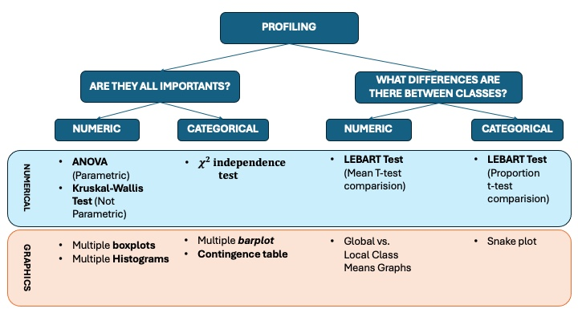

```{r}
#| label: setup
#| include: false

# Paquetes necesarios
paquetes <- c(
  "dendextend", "NbClust", "cluster", "ggpubr", "FactoMineR",
  "modeest", "FactoClass", "dplyr", "ggplot2", "fpc", "psych"
)

new.packages <- paquetes[!(paquetes %in% installed.packages()[, "Package"])]
if (length(new.packages) > 0) install.packages(new.packages)
invisible(lapply(paquetes, require, character.only = TRUE))

# URL de datos
url <- "https://raw.githubusercontent.com/ramIA-lab/MLforEducation/refs/heads/main/material/clustering/shopping_behavior_updated.csv"

# Carga de datos
# Usamos stringsAsFactors = FALSE para controlar explícitamente la conversión
dades <- read.csv(url, stringsAsFactors = FALSE)

# Tipos de variables
tipo <- sapply(dades, class)
varNum <- names(tipo)[tipo %in% c("integer", "numeric")]
varNum <- setdiff(varNum, "Customer.ID")
varCat <- names(tipo)[tipo %in% c("character", "factor")]

# Conversión de categóricas a factor
for (vC in varCat) dades[[vC]] <- as.factor(dades[[vC]])
```

# Objetivo

Este documento realiza el **profiling completo de un clustering jerárquico** aplicado sobre una base de datos con variables mixtas (numéricas y categóricas). El flujo sigue estas fases:

1. **Carga y preparación de los datos**.  
2. **Cálculo de distancias de Gower** para datos mixtos.  
3. **Clustering jerárquico** con criterio Ward.  
4. **Asignación de individuos a clústeres**.  
5. **Fase 1 de profiling**: detección de variables significativas.  
6. **Cálculo de centroides/modas por clúster**.  
7. **Fase 2 de profiling**: significación de modalidades mediante enfoque de Lebart.  

# Vista general de los datos

## Dimensiones y estructura

```{r}
#| label: estructura-datos
list(
  dimensiones = dim(dades),
  variables_numericas = varNum,
  variables_categoricas = varCat
)
```

## Primeras filas

```{r}
#| label: head-datos
head(dades)
```

## Resumen descriptivo

```{r}
#| label: resumen-datos
summary(dades)
```

# Clustering jerárquico sobre datos mixtos

## Cálculo de distancias de Gower

```{r}
#| label: gower

distancias <- cluster::daisy(dades, metric = "gower")
distancias2 <- distancias^2

cat("Número de observaciones:", nrow(dades), "\n")
cat("Número de distancias almacenadas:", length(distancias), "\n")
```

## Construcción del dendrograma

```{r}
#| label: hclust
#| fig-width: 11
#| fig-height: 6

hc <- hclust(distancias2, method = "ward.D2")
plot(hc, main = "Dendrograma del clustering jerárquico", xlab = "", sub = "")
```

## Dendrograma coloreado para k = 2

```{r}
#| label: dendrograma-k2
#| fig-width: 11
#| fig-height: 6

as.dendrogram(hc) |>
  set("branches_k_color", k = 2) |>
  plot(main = "Dendrograma con ramas coloreadas (k = 2)")
```

## Corte del árbol y asignación de clúster

```{r}
#| label: corte-arbol

dades$cluster <- as.factor(cutree(hc, k = 2))

table(dades$cluster)
```

## Calidad interna básica del clustering

```{r}
#| label: stats-clustering
fpc::cluster.stats(distancias2, clustering = as.numeric(dades$cluster))
```

# Profiling

{fig-align="center"}

## Fase 1 del profiling: variables que diferencian los grupos

En esta fase se identifican las variables que discriminan significativamente entre clústeres.

- Para variables **numéricas**:
  - Se evalúa normalidad con **Shapiro-Wilk**.
  - Si hay normalidad, se aplica **ANOVA**.
  - Si no hay normalidad, se aplica **Kruskal-Wallis**.
- Para variables **categóricas**:
  - Se aplica **Chi-cuadrado de independencia**.

```{r}
#| label: fase1-calculo

columnasValidar <- setdiff(colnames(dades), c("Customer.ID", "cluster"))
variablesPasanFase1 <- c()
resultadosFase1 <- list()

for (cV in columnasValidar) {
  clase_var <- class(dades[[cV]])[1]
  
  # =====================
  # VARIABLES NUMÉRICAS
  # =====================
  if (clase_var %in% c("integer", "numeric")) {
    shapiro_ok <- FALSE
    p_shapiro <- NA_real_
    metodo <- NA_character_
    p_valor <- NA_real_
    detalle <- NULL
    
    # Shapiro falla si hay demasiados datos o valores constantes; controlamos eso.
    sh <- tryCatch(shapiro.test(dades[[cV]]), error = function(e) NULL)
    if (!is.null(sh)) {
      p_shapiro <- sh$p.value
      shapiro_ok <- p_shapiro > 0.05
    }
    
    if (!is.na(p_shapiro) && shapiro_ok) {
      test_obj <- aov(dades[[cV]] ~ dades$cluster)
      detalle <- summary(test_obj)
      p_valor <- detalle[[1]][["Pr(>F)"]][1]
      metodo <- "ANOVA"
    } else {
      test_obj <- kruskal.test(dades[[cV]] ~ dades$cluster)
      detalle <- test_obj
      p_valor <- test_obj$p.value
      metodo <- "Kruskal-Wallis"
    }
    
    if (!is.na(p_valor) && p_valor <= 0.05) {
      variablesPasanFase1 <- c(variablesPasanFase1, cV)
    }
    
    resultadosFase1[[cV]] <- list(
      tipo = "Numérica",
      metodo = metodo,
      p_shapiro = p_shapiro,
      p_valor = p_valor,
      detalle = detalle
    )
  }
  
  # =======================
  # VARIABLES CATEGÓRICAS
  # =======================
  if (clase_var %in% c("factor", "character")) {
    test_obj <- suppressWarnings(chisq.test(dades[[cV]], dades$cluster))
    p_valor <- test_obj$p.value
    
    if (!is.na(p_valor) && p_valor <= 0.05) {
      variablesPasanFase1 <- c(variablesPasanFase1, cV)
    }
    
    resultadosFase1[[cV]] <- list(
      tipo = "Categórica",
      metodo = "Chi-cuadrado",
      p_valor = p_valor,
      detalle = test_obj
    )
  }
}

variablesPasanFase1 <- unique(variablesPasanFase1)
variablesPasanFase1
```

### Tabla resumen de significación

```{r}
#| label: tabla-fase1

tablaFase1 <- dplyr::bind_rows(lapply(names(resultadosFase1), function(v) {
  x <- resultadosFase1[[v]]
  data.frame(
    variable = v,
    tipo = x$tipo,
    metodo = x$metodo,
    p_shapiro = ifelse(is.null(x$p_shapiro), NA, x$p_shapiro),
    p_valor = x$p_valor,
    significativa = ifelse(!is.na(x$p_valor) & x$p_valor <= 0.05, "Sí", "No")
  )
}))

tablaFase1 <- tablaFase1 |>
  arrange(tipo, p_valor)

tablaFase1
```

## Visualización de variables del profiling

### Variables numéricas

```{r}
#| label: nombres-numericas
vars_num_a_graficar <- columnasValidar[sapply(dades[columnasValidar], function(x) class(x)[1] %in% c("integer", "numeric"))]
vars_num_a_graficar
```

```{r}
#| label: graficos-numericos
#| results: asis

for (cV in vars_num_a_graficar) {
  cat("### ", cV, "\n\n", sep = "")
  
  graficoBoxplot <- ggpubr::ggboxplot(dades, "cluster", cV, fill = "cluster")
  graficoHistograma <- ggpubr::gghistogram(
    dades, x = cV,
    add = "mean", rug = TRUE,
    color = "cluster", fill = "cluster"
  )
  
  grafico <- ggpubr::ggarrange(
    graficoBoxplot, graficoHistograma,
    heights = c(2, 0.7),
    ncol = 2, nrow = 1, align = "v"
  )
  
  print(grafico)
  cat("\n")
}
```

### Variables categóricas

```{r}
#| label: nombres-categoricas
vars_cat_a_graficar <- columnasValidar[sapply(dades[columnasValidar], function(x) class(x)[1] %in% c("factor", "character"))]
vars_cat_a_graficar
```

```{r}
#| label: graficos-categoricos
#| results: asis
#| fig-width: 10
#| fig-height: 5

for (cV in vars_cat_a_graficar) {
  cat("### ", cV, "\n\n", sep = "")
  
  tabla <- data.frame(table(dades[[cV]], dades$cluster))
  colnames(tabla) <- c("modalidad", "cluster", "Freq")
  
  grafico <- ggplot(tabla, aes(x = modalidad, y = Freq, fill = cluster)) +
    geom_bar(stat = "identity", position = "dodge") +
    labs(title = paste("Distribución de", cV, "por clúster"), x = cV, y = "Frecuencia") +
    theme_minimal() +
    theme(axis.text.x = element_text(angle = 45, hjust = 1))
  
  print(grafico)
  cat("\n")
}
```

## Centroides y modas por clúster

### Variables numéricas significativas

```{r}
#| label: centroides-numericos

datosAnalizarNum <- dades[, intersect(variablesPasanFase1, varNum), drop = FALSE]

if (ncol(datosAnalizarNum) > 0) {
  psych::describeBy(datosAnalizarNum, dades$cluster, mat = TRUE)
} else {
  cat("No hay variables numéricas significativas en la fase 1.")
}
```

### Variables categóricas significativas: moda por clúster

```{r}
#| label: modas-categoricas

variablesAnalizarCAT <- intersect(variablesPasanFase1, varCat)
listaModa <- list()

if (length(variablesAnalizarCAT) > 0) {
  for (vC in variablesAnalizarCAT) {
    tabla <- data.frame(table(dades[[vC]], dades$cluster))
    colnames(tabla) <- c("modalidad", "cluster", "Freq")
    
    calModa <- tabla |>
      dplyr::group_by(cluster) |>
      dplyr::filter(Freq == max(Freq)) |>
      dplyr::select(modalidad, cluster, Freq) |>
      as.data.frame()
    
    listaModa[[vC]] <- calModa
  }
  
  listaModa
} else {
  cat("No hay variables categóricas significativas en la fase 1.")
}
```

## Fase 2 del profiling: significación de modalidades (Lebart)

La segunda fase profundiza en la interpretación de los clústeres identificando:

- **Qué medias numéricas** caracterizan más a cada grupo.
- **Qué modalidades categóricas** están sobrerrepresentadas o infrarrepresentadas.

### Resultados globales con `catdes()`

```{r}
#| label: catdes-global
res_catdes <- FactoMineR::catdes(dades, num.var = ncol(dades))
res_catdes
```

### Gráfico de variables cuantitativas

```{r}
#| label: catdes-quanti
#| fig-width: 11
#| fig-height: 7
plot(res_catdes, show = "quanti", col.upper = "red", col.lower = "blue", 
     barplot = TRUE, cex.names = 1)
```

### Gráfico de variables cualitativas

```{r}
#| label: catdes-quali
#| fig-width: 11
#| fig-height: 7
plot(res_catdes, show = "quali", col.upper = "red", col.lower = "blue", 
     barplot = FALSE, cex.names = 1.2)
```

### Gráfico conjunto

```{r}
#| label: catdes-all
#| fig-width: 11
#| fig-height: 7
plot(res_catdes, show = "all", col.upper = "red", col.lower = "blue", 
     barplot = FALSE, cex.names = 1.2)
```

### Test de Lebart para variables numéricas

```{r}
#| label: lebart-numericas

dadesF <- FactoClass::Fac.Num(dades)
dades_num <- cbind(dadesF$numeric, dadesF$integer)
class_cluster <- dadesF$factor$cluster

if (ncol(dades_num) > 0) {
  prueba_num <- cluster.carac(
    dades_num, class_cluster,
    tipo.v = "co", v.lim = 1.96, neg = TRUE
  )
  prueba_num
} else {
  cat("No hay variables numéricas disponibles para el test de Lebart de medias.")
}
```

### Test de Lebart para variables categóricas

```{r}
#| label: lebart-categoricas

dades_cat <- dadesF$factor |> dplyr::select(-cluster)
class_cluster <- dadesF$factor$cluster

if (ncol(dades_cat) > 0) {
  prueba_cat <- cluster.carac(
    dades_cat, class_cluster,
    tipo.v = "ca", v.lim = 1.96, neg = FALSE
  )
  prueba_cat
} else {
  cat("No hay variables categóricas disponibles para el test de Lebart de proporciones.")
}
```

## Conclusiones automáticas del profiling

### Variables significativas detectadas

```{r}
#| label: conclusiones-significativas
sig <- tablaFase1 |> dplyr::filter(significativa == "Sí")
sig
```

### Resumen interpretativo

```{r}
#| label: resumen-interpretativo

cat("Número total de variables analizadas:", length(columnasValidar), "\n")
cat("Variables significativas en fase 1:", length(variablesPasanFase1), "\n\n")

if (length(variablesPasanFase1) > 0) {
  cat("Variables que mejor diferencian los clústeres:\n")
  cat(paste0("- ", variablesPasanFase1, collapse = "\n"))
} else {
  cat("No se han detectado variables significativas con el umbral p <= 0.05.")
}
```


